# Hegels *Wissenschaft der Logik* — Querverweisdiagramm

## Dialektische Gesamtbewegung mit allen Querverweisen

```mermaid
graph TD
    subgraph SEINSLOGIK["ERSTES BUCH: DIE LEHRE VOM SEIN"]
        Sein([Sein / Seyn])
        Nichts([Nichts])
        Werden([Werden])
        Dasein([Dasein / Daseyn])
        Qualitaet([Qualität])
        Etwas([Etwas und Anderes])
        Endlichkeit([Endlichkeit])
        Unendlichkeit([Unendlichkeit])
        Fuersichsein([Fürsichsein])
        Eins([Eins / Vieles])
        Quantitaet([Quantität])
        Quantum([Quantum · Zahl · Grad])
        Mass([Maß])
        Indifferenz([Absolute Indifferenz])
    end

    subgraph WESENSLOGIK["ZWEITES BUCH: DIE LEHRE VOM WESEN"]
        Wesen([Wesen])
        Schein([Schein])
        Reflexion([Reflexion])
        Identitaet([Identität])
        Unterschied([Unterschied])
        Widerspruch([Widerspruch])
        Grund([Grund])
        Existenz([Existenz])
        Erscheinung([Erscheinung])
        Gesetz([Gesetz der Erscheinung])
        GanzesTeile([Ganzes und Teile])
        Kraft([Kraft und Äußerung])
        AeuInneres([Äußeres und Inneres])
        Wirklichkeit([Wirklichkeit])
        Absolute([Das Absolute])
        Substanz([Substanz / Akzidenz])
        Kausalitaet([Kausalität])
        Wechselwirkung([Wechselwirkung])
    end

    subgraph BEGRIFFSLOGIK["DRITTES BUCH: DIE LEHRE VOM BEGRIFF"]
        Begriff([Begriff])
        AllgBesEinz([Allgemeinheit · Besonderheit · Einzelheit])
        Urteil([Urteil / Urtheil])
        Schluss([Schluss / Schluß])
        Objektivitaet([Objektivität])
        Mechanismus([Mechanismus])
        Chemismus([Chemismus])
        Teleologie([Teleologie])
        Idee([Idee])
        Leben([Leben])
        Erkennen([Erkennen])
        AbsoluteIdee([Absolute Idee])
    end

    %% ========== HAUPTGANG: Seinslogik ==========
    Sein ==> Nichts
    Nichts ==> Werden
    Werden ==>|resultiert in| Dasein
    Dasein --> Qualitaet
    Qualitaet --> Etwas
    Etwas --> Endlichkeit
    Endlichkeit --> Unendlichkeit
    Unendlichkeit -->|Aufhebung| Fuersichsein
    Fuersichsein --> Eins
    Eins --> Quantitaet
    Quantitaet --> Quantum
    Quantum --> Mass
    Mass --> Indifferenz
    Indifferenz ==>|Übergang in| Wesen

    %% ========== HAUPTGANG: Wesenslogik ==========
    Wesen --> Schein
    Schein --> Reflexion
    Reflexion --> Identitaet
    Identitaet --> Unterschied
    Unterschied --> Widerspruch
    Widerspruch -->|geht zu Grunde| Grund
    Grund -->|entlässt sich in| Existenz
    Existenz --> Erscheinung
    Erscheinung --> Gesetz
    Gesetz --> GanzesTeile
    GanzesTeile --> Kraft
    Kraft --> AeuInneres
    AeuInneres --> Wirklichkeit
    Wirklichkeit --> Absolute
    Absolute --> Substanz
    Substanz --> Kausalitaet
    Kausalitaet --> Wechselwirkung
    Wechselwirkung ==>|Genesis des| Begriff

    %% ========== HAUPTGANG: Begriffslogik ==========
    Begriff --> AllgBesEinz
    AllgBesEinz -->|Diremtion| Urteil
    Urteil -->|Wiederherstellung| Schluss
    Schluss -->|Realisierung| Objektivitaet
    Objektivitaet --> Mechanismus
    Mechanismus --> Chemismus
    Chemismus --> Teleologie
    Teleologie --> Idee
    Idee --> Leben
    Leben -->|Tod / Übergang| Erkennen
    Erkennen --> AbsoluteIdee

    %% ========== QUERVERWEISE: Seinslogik intern ==========
    Sein -.-> Nichts
    Nichts -.-> Sein
    Sein -.-> Werden
    Nichts -.-> Werden
    Dasein -.-> Sein
    Dasein -.-> Nichts
    Qualitaet -.-> Dasein
    Fuersichsein -.-> Unendlichkeit
    Fuersichsein -.-> Qualitaet
    Quantitaet -.-> Qualitaet
    Quantitaet -.-> Fuersichsein
    Mass -.-> Qualitaet
    Mass -.-> Quantitaet
    Indifferenz -.-> Wesen

    %% ========== QUERVERWEISE: Wesenslogik intern ==========
    Schein -.-> Sein
    Schein -.-> Wesen
    Reflexion -.-> Schein
    Reflexion -.-> Wesen
    Identitaet -.-> Unterschied
    Unterschied -.-> Identitaet
    Widerspruch -.-> Identitaet
    Widerspruch -.-> Unterschied
    Grund -.-> Widerspruch
    Grund -.-> Identitaet
    Grund -.-> Unterschied
    Existenz -.-> Grund
    Erscheinung -.-> Wesen
    Erscheinung -.-> Existenz
    Gesetz -.-> Erscheinung
    Wirklichkeit -.-> Wesen
    Wirklichkeit -.-> Erscheinung
    Absolute -.-> Wirklichkeit
    Substanz -.-> Wesen
    Kausalitaet -.-> Substanz
    Kausalitaet -.-> Grund
    Wechselwirkung -.-> Kausalitaet
    Wechselwirkung -.-> Substanz

    %% ========== QUERVERWEISE: Begriffslogik intern ==========
    Begriff -.-> Urteil
    Urteil -.-> Schluss
    Schluss -.-> Objektivitaet
    Objektivitaet -.-> Idee
    Idee -.-> Begriff
    Idee -.-> Objektivitaet
    Leben -.-> Idee
    Erkennen -.-> Leben
    Erkennen -.-> Idee
    AbsoluteIdee -.-> Erkennen
    AbsoluteIdee -.-> Leben
    AbsoluteIdee -.-> Idee

    %% ========== BUCHÜBERGREIFENDE QUERVERWEISE ==========
    Wesen -.-> Sein
    Wesen -.-> Dasein
    Wesen -.-> Quantitaet
    Wesen -.-> Indifferenz

    Widerspruch -.-> Werden

    Begriff -.-> Sein
    Begriff -.-> Wesen
    Begriff -.-> Substanz
    Begriff -.-> Wechselwirkung

    Wirklichkeit -.-> Begriff
    Wechselwirkung -.-> Begriff

    Idee -.-> Wirklichkeit
    AbsoluteIdee -.-> Sein
    AbsoluteIdee -.-> Begriff

    %% ========== STYLE CLASSES ==========
    classDef seins fill:#dae8fc,stroke:#6c8ebf,color:#000
    classDef wesens fill:#d5e8d4,stroke:#82b366,color:#000
    classDef begriffs fill:#e1d5e7,stroke:#9673a6,color:#000
    classDef uebergang fill:#fff2cc,stroke:#d6b656,color:#000

    class Sein,Nichts,Werden,Dasein,Qualitaet,Etwas,Endlichkeit,Unendlichkeit,Fuersichsein,Eins,Quantitaet,Quantum,Mass,Indifferenz seins
    class Wesen,Schein,Reflexion,Identitaet,Unterschied,Widerspruch,Grund,Existenz,Erscheinung,Gesetz,GanzesTeile,Kraft,AeuInneres,Wirklichkeit,Absolute,Substanz,Kausalitaet,Wechselwirkung wesens
    class Begriff,AllgBesEinz,Urteil,Schluss,Objektivitaet,Mechanismus,Chemismus,Teleologie,Idee,Leben,Erkennen,AbsoluteIdee begriffs
    class Werden,Wesen,Begriff,AbsoluteIdee uebergang
```



---

## Legende

| Element | Bedeutung |
|---------|-----------|
| `==>` (dick) | Dialektischer Hauptgang — notwendige Bewegung des Begriffs |
| `-->` (dünn) | Logischer Folgeschritt innerhalb eines Buches |
| `-.->` (gestrichelt) | Querverweis / Reflexionsbeziehung / Rückbezug |
| **Blau** | Seinslogik — Sphäre der Unmittelbarkeit |
| **Grün** | Wesenslogik — Sphäre der Reflexion |
| **Violett** | Begriffslogik — Sphäre der Entwicklung |
| **Gelb** | Übergangsknoten zwischen den Sphären |

## Die vier großen Übergänge

```
Sein/Nichts → Werden → Dasein
Maß/Indifferenz → Wesen
Wechselwirkung → Begriff
Absolute Idee → (Entlassung in Natur/Geist)
```
